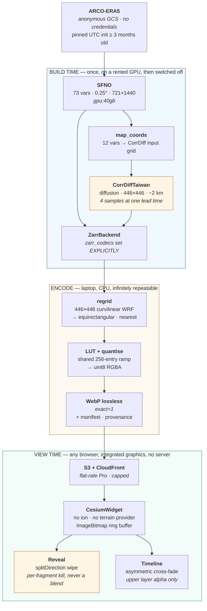

# Latent Sky — Architecture

> **Status:** Architecture / pre-implementation
> **Document:** `DOCS/Architecture.md`
> **Version:** 0.4
> **Owner:** Kira Ryan
> **Last updated:** 31 July 2026
> **Changes in 0.2:** Probe 2 executed. §3.3, §3.4, §5.4, §7.1, §8 and §12 now carry measured values rather than inferred ones. Output grid corrected 446→448.
> **Changes in 0.3:** Probe 3 executed. §3.7 carries measured contamination figures; the failure is located to the fly-down rather than the wipe. Node ≥ 22 requirement recorded in §6.4.
> **Changes in 0.4:** Probe 4 executed and the encode pipeline and web app are built and verified against real data. §8 rewritten from measurement. New: §6.5 (request-scheduler starvation), §5.4 footprint mask and grid rule, §7.1 global t2m floor, §8.1 gate metric.
> **Changes in 0.5:** Global ERA5 layer and the M5 art pass built and verified end to end (dark basemap, fly-down, arrival). Schema gained an optional `basemap` object. tcwv ramp widened 70→80 kg/m² (real Chanthu peaks at 79.58 — measured). §8 row 12 now measured (130 KB/frame); row 1 restated at 0.77 MB brotli; a global dark basemap costs 0.06 MB. Camera motion is owned by a single CameraDirector (the §6.5 starvation class applies to camera tweens too).
> **Supersedes:** the technology and hosting assumptions in `DOCS/concept.md` §7, and the open questions in §12

---

## 1. What this document is

`concept.md` defines what Latent Sky is and why it exists. This document defines **how it is built**, and it resolves the nine open questions that document deliberately left to the architecture phase.

It is written to be executed. Where a decision is load-bearing, the code sketch that implements it is included, because the gap between "use a wipe for the comparison" and "the wipe is a per-fragment kill, not a blend, and that is precisely why it is correct" is where this project succeeds or fails.

Every factual claim here was verified against a primary source — the earth2studio source at tag `0.17.0`, the CesiumJS 1.143.0 build, NGC and Hugging Face model registries, and live AWS pricing feeds — on 30 July 2026. Claims that could **not** be verified are marked as such and carry a probe in §14.

### 1.1 How to read it

Sections 2 and 3 are the ones to read first, and section 3 is the one that changes the project. Sections 4 to 9 are the design. Sections 10 to 13 are delivery. Section 14 is what to do on the first weekend, and is arguably the most useful page in the document.

---

## 2. Executive summary

Latent Sky is buildable substantially as conceived, and the single largest perceived risk turned out not to be a risk at all — NVIDIA ships a working, tested example of the exact coarse-to-fine model chain the hero moment depends on. That converts the project's scariest unknown into a file to copy.

Four things changed materially:

**The hero region is not a choice.** There is exactly one publicly downloadable kilometre-scale CorrDiff checkpoint, and Taiwan is baked into its weights. The Great Plains, atmospheric rivers and derechos are off the table.

**The hero variable had to change.** The coarse global model produces no radar reflectivity of any kind, so a before/after on reflectivity has no "before". The reveal is **10 m wind speed**. This is covered in §3.1 and it has the largest blast radius of any finding here.

**The global model changed.** FourCastNet-3 needs an 80 GB GPU and has a documented unresolved out-of-memory failure on the 46 GB class. **SFNO** does the same job on a 40 GB-class card, is the model in NVIDIA's validated example, and halves the rental tier.

**Cesium's defaults break the reveal before any data exists.** The ground-atmosphere and fog shaders tint imagery differently at globe framing than at hero framing. Identical bytes, visibly different colours, at exactly the two ends of the comparison. This is the stated failure mode of the hero feature, present by default, and it is not a colour-map problem.

The payload lands at **6.23 MB eager, ~2.55 MB to a first interactive globe**, against a 12 MB hard ceiling enforced in CI. Producing the dataset costs **$19–47** of rented GPU. Steady-state hosting is **$15/month** flat, capped.

---

## 3. Corrections to the concept document

These supersede `concept.md`. Each is stated with what the concept assumed, what is actually true, and the consequence.

### 3.1 The reveal variable — reflectivity is impossible, use wind speed

**The concept implies** (§5.1, §8.4) a reveal in which "rain bands acquire edges" and "convective cells appear" — the language of radar reflectivity or precipitation.

**Actually true:** `CorrDiffTaiwan.OUT_VARIABLES = ["mrr", "t2m", "u10m", "v10m"]`. SFNO's 73 variables are `u10m, v10m, u100m, v100m, t2m, sp, msl, tcwv` plus `u/v/z/t/q` on 13 pressure levels. **There is no reflectivity anywhere in the coarse model.** The only three fields present on both sides are `t2m`, `u10m` and `v10m`.

**Consequence:** the before/after is **10 m wind speed**, computed as `sqrt(u10m² + v10m²)` identically on both sides. Over a typhoon this is the more dramatic choice anyway — the coarse field is a smooth blob, the fine field resolves an eyewall and terrain-locked flow over the Central Mountain Range.

Reflectivity (`mrr`) is not discarded. It becomes a **separate single-layer panel**, framed honestly as *a field the coarse model cannot produce at all*. That is a true and interesting statement about what the downscaling model adds. Presenting it as a before/after against a different variable would be two pictures with two colour ramps, which is the precise failure the brief forbids.

### 3.2 The hero region is Taiwan, and it is not selectable in principle

`CorrDiff.load_default_package()` raises `NotImplementedError` on the base class. `CorrDiffTaiwan` is the only concrete public km-scale package.

The European `CorrDiffCosmoEra5` (2.2 km, and whose own docstring names the SFNO→CorrDiff chain) resolves to `hf://nvidia/corrdiff-cosmo-era5`, which returns **HTTP 401**. A Hugging Face account will not unblock it: a known public-but-gated repository returns 200 with `gated: "manual"` to anonymous callers, while a nonexistent or private one returns 401. This is unpublished, not gated. The CONUS checkpoint is 3 km, NIM-gated, and has no earth2studio class.

**Consequence:** Taiwan, fixed at build time. Open question #5 is answered by the model registry rather than by us.

### 3.3 "~2 km" is correct — measured, not inferred

**Settled by Probe 2 (§14), which has been run.** The measured mean cell size on the actual `XLAT`/`XLONG` arrays is **2.0684 km** (x: 2.0684, y: 2.0684, σ = 0.003 km — the grid is remarkably uniform).

The concept was right and earth2studio's own example page, which says 3 km, is wrong. **Publish ~2 km.**

For the record, the naive latitude-span arithmetic gives 2.0920 km, which is 1.1% high because it ignores the grid's rotation. The great-circle measurement is the honest figure.

### 3.4 CorrDiff's output grid is 448×448 and curvilinear

**Measured.** The package's `XLAT`/`XLONG` are **450×450**. `corrdiff.py:1323` does `register_buffer("out_lat", out_lat[1:-1, 1:-1])`, and the class docstring at line 1279 states *"Output latitude grid of size [448, 448]"*. `output_coords()` returns `self.out_lat` directly.

**The output grid is 448 × 448.** (An earlier draft of this document said 446×446, propagating a research arithmetic slip — 450 − 2 = 448.)

Measured extent of the cropped output grid:

| | Min | Max | Span |
|---|---|---|---|
| Latitude | 19.5187° N | 27.9282° N | 8.4095° |
| Longitude | 116.1372° E | 125.5459° E | 9.4087° |

**The curvature is large enough to matter, and this is now quantified.** On a true equirectangular grid, latitude is constant along a row and longitude along a column. Measured:

- latitude varies along a row by up to **0.1015° (11.3 km)**
- longitude varies along a column by up to **0.3636° (37.0 km)**
- the bottom row runs **0.34° off due east**

Treating this as a plain lat/lon box would misplace features by up to 37 km. Taiwan is about 400 km long. That is a 9%-of-the-island georeferencing error — visible, wrong, and exactly the sort of thing a meteorologist would spot instantly.

Reproduce with [`probes/probe2_corrdiff_grid.py`](../probes/probe2_corrdiff_grid.py) — no GPU, no credentials, about forty minutes of which thirty-nine are the download.

`ImageryLayer` requires equirectangular imagery. **The regrid stage is mandatory**, it appears nowhere in the concept, and it is specified in §5.4.

### 3.4.1 The input grid, and the number that belongs in the README

`CorrDiffTaiwan.input_coords()` is a regular 0.25° grid:

```python
"lat": np.linspace(19.25, 28, 36, endpoint=True),
"lon": np.linspace(116, 126, 40, endpoint=False),
```

**36 × 40 = 1,440 cells in. 448 × 448 = 200,704 cells out.** That is a **139× increase in grid cells**, from ~25 km to 2.07 km. It is the single most quotable number the project produces, and it is measured rather than claimed.

### 3.5 `ZarrBackend` writes uncompressed by default

`zarr_codecs: CompressorsLike = None`, docstring *"If None, will use no compressor"*. Default chunking also leaves lat/lon unchunked, so one chunk is one full 721×1440 float32 field — 4,152,960 bytes.

On a project whose stated primary risk is payload, this must be overridden in the first line of pipeline code that touches it.

### 3.6 The ERA5 credential barrier does not exist, and the reproducibility argument is backwards

`earth2studio.data.ARCO` reads a public Google Cloud bucket with `store_kwargs={"skip_signature": True}` — anonymous HTTPS, no account, no key, no queue. Only `earth2studio.data.CDS` has a credential barrier, and its real problem is worse than a key: dataset terms must be accepted *manually from the dataset page in a browser*, which cannot be automated on a headless rented GPU. **Use ARCO. Never touch CDS.**

The reproducibility logic also inverts. ERA5T preliminary data for the most recent two to three months **is overwritten** by final ERA5, making ERA5 byte-unstable inside that window — worse than GFS, whose archived past cycles are never rewritten. The deployed artefact renders identically forever because inference is baked at build time, not because of the data source.

The correct rule is: **pin an exact UTC timestamp at least three months old.** The real reason to prefer ERA5 is in-distribution fidelity to what SFNO and CorrDiffTaiwan were trained on, which is a scientific argument, not a reproducibility one.

### 3.7 Cesium's defaults break colour identity across the reveal

This is the most insidious finding in the document, because it produces exactly the failure the concept names in open question #9 — *"the reveal reads as colour shifting rather than detail appearing"* — while the colour pipeline is entirely correct.

`Globe.showGroundAtmosphere` defaults to `true`. Beyond `lightingFadeOutDistance` (π/2 × 6,356,752 m ≈ 9,985 km from Earth's centre) `GlobeFS` computes `finalColor.rgb + groundAtmosphereColor.rgb * transmittance`, compresses it through `1.0 - exp(-2.0 * c)`, and mixes by `fade`. A whole-globe framing sits at `fade ≈ 0.28`; the zoomed hero view sits at `fade = 0`.

**Identical PNG bytes render as different colours at the two ends of the reveal.** `Fog.enabled` also defaults true and hits the near field. Mipmapping compounds it: a mip texel is the RGB mean of four ramp *colours*, which for any curved ramp path is not the ramp colour of the mean *value*, so the minified layer desaturates while the magnified one does not.

The mitigation is four lines at widget construction, given in §7.2(c).

#### Measured — Probe 3, run 31 July 2026, CesiumJS 1.143.0 in real Chrome

Two solid-colour layers, one authored byte value each, sampled at the **same canvas pixel** at whole-globe framing (15,000 km) and hero framing (250 km):

| Config | Authored | At globe zoom | At hero zoom | Δ | |
|---|---|---|---|---|---|
| **defaults** | (64, 160, 208) | (113, 194, 218) | (64, 160, 208) | **(+49, +34, +10)** | contaminated |
| **defaults** | (20, 30, 60) | (54, 85, 137) | (20, 30, 60) | **(+34, +55, +77)** | contaminated |
| fixed | (64, 160, 208) | (64, 160, 208) | (64, 160, 208) | (0, 0, 0) | identical |
| fixed | (20, 30, 60) | (20, 30, 60) | (20, 30, 60) | (0, 0, 0) | identical |

**Confirmed, and worse than predicted.** Three things this measurement adds that the source reading could not:

**It is far more severe on dark values.** The dark sample gains **+77 on blue — 30% of full scale** — and lightens by roughly 2.7×. Its hue shifts materially toward blue-grey. On a dark globe, low ramp values are where most of a weather field lives, so the contamination is worst exactly where the data is densest.

**At hero zoom the rendered byte equals the authored byte exactly.** This independently confirms that with HDR off the colour pipeline is a pass-through — `czm_gammaCorrect` is a no-op and imagery uploads as plain `PixelFormat.RGBA`. The contamination is purely additive atmosphere at distance, not a gamma or encoding problem. So the authored byte *is* the sampled byte, once the four lines are set.

**The wipe itself is clean — the danger is the camera move.** Split symmetry was **identical in all four cases**, defaults included: sampling mirrored pixels either side of the divider gave (0, 0, 0) delta at both framings. That verifies §6.3's claim that `splitDirection` is a per-fragment kill with no blending, and it locates the failure precisely. A wipe at a *fixed* camera position is colour-safe even with defaults on. What breaks is the **fly-down** — the viewer descending from orbit watches the entire field change colour before the reveal even starts, which reads as *the data changed*, destroying the "same atmosphere, more detail" claim the hero rests on.

Probe 3 also confirmed `scene.msaaSamples` defaults to **4**, which §6.4 sets to 1 for integrated graphics.

Reproduce with [`probes/probe3-colour-identity/`](../probes/probe3-colour-identity/) — `npm install && node run.mjs`, about a minute, no data and no GPU required. It exits non-zero if any fixed config is contaminated, so it can go straight into CI.

### 3.8 The model chain is validated, not experimental

The largest perceived risk in the plan — whether a coarse global model can feed CorrDiff at all — is answered by a shipped file. `examples/03_downscaling/03_ensemble_downscaling.py` exists at tag `0.17.0` and does exactly this, on Typhoon Doksuri, `start_date = datetime(2023, 7, 26, 12)`.

**Consequence for scheduling:** run that file verbatim in the first thirty minutes of the first GPU hour. See §14, Probe 1. This is the single highest-value ordering decision in the plan.

### 3.9 The novelty claim must be narrowed

NVIDIA already ships a public, no-login, browser-accessible interactive Earth-2 3D globe, pixel-streamed from Omniverse Cloud GDN. Google DeepMind's Weather Lab is a public interactive AI-forecast site. Microsoft open-sourced Aurora 1.5 in July 2026.

"AI weather on a globe" has no novelty left and the README must not claim it.

What survives falsification is **architectural**: every interactive Earth-2 visualisation NVIDIA ships requires a GPU at view time — GDN streams frames from cloud GPUs, and the Earth-2 Command Center is an Omniverse Kit desktop application requiring a server federation. Latent Sky puts a comparable class of visual in a folder of static files running on integrated graphics. That, plus the user-driven reveal (NVIDIA publishes its coarse-versus-fine comparisons only as static matplotlib figures), is the honest claim. Nothing more. §15 covers this.

### 3.10 The licence hazard is not the one you would expect

The CorrDiff **checkpoints are Apache-2.0** — verified verbatim on NGC, unauthenticated, `isPublic: true`. The restrictive NVIDIA community licence applies only to the NIM-gated CONUS model we are not using.

The actual hazard: the same 717 MB package bundles `dataset/2023-01-24-cwb-4years_5times.zarr` under **CC BY-NC-ND 4.0**, and `load_model` reads it at runtime for `XLAT`/`XLONG` and the `cwb_center`/`cwb_scale` normalisation constants. NonCommercial-NoDerivatives is the single term in this stack incompatible with publishing derived output.

The mandatory regrid of §3.4 resolves it as a side effect: publishing on our own grid means no ND-licensed coordinate array is ever redistributed. Two problems, one stage.

---

## 4. System overview



### 4.1 The three-stage split

`concept.md` §6.1 names a two-box split. The research forces a **third box**, and it is a genuine improvement.

The GPU stage is one-shot, expensive and irreversible — a diffusion sampler cannot be byte-reproduced. It must therefore produce a small archivable artefact and stop. **Every decision about colour, range, resolution, framing and format then becomes a free laptop re-run.** Splitting at the Zarr boundary is what makes this survivable on weekends: getting the ramp wrong costs an hour on a laptop, not another rented GPU session.

---

## 5. Build time — the pipeline

### 5.1 Model chain

| Stage | Model | Package | VRAM badge | Why |
|---|---|---|---|---|
| Prognostic | **SFNO** | `ngc://models/nvidia/modulus/sfno_73ch_small@0.1.0` | `gpu:40gb` | The model in NVIDIA's validated chain example; all 12 CorrDiff inputs present natively |
| Downscaling | **CorrDiffTaiwan** | `ngc://models/nvidia/modulus/corrdiff_inference_package@1` | `gpu:40gb` | The only public km-scale checkpoint; Apache-2.0; 717,175,567 bytes, unauthenticated |

**FourCastNet-3 is rejected.** It carries a `gpu:80gb` badge and a documented unresolved OOM on a 46 GB L40S that survived fp16, fp32, bf16 and `expandable_segments`. Choosing it doubles the rental tier for no benefit. Note the counterweight: SFNO's NGC package is **6.87 GiB**, 2.4× larger than FCN3's entire repository — it must be baked into the container image, never re-downloaded on metered time.

**Atlas is rejected** on a subtler ground worth recording: issue #681 confirms it silently ingests all-zero `sst` from GFS and produces checkerboarded output, confirmed by a maintainer.

### 5.2 The forecast stage

Runs once, on the GPU. Hand-rolls the loop exactly as NVIDIA's example does — **do not** route CorrDiff through `run.diagnostic`, because CorrDiff emits `sample`/`batch` dimensions the generic path is not exercised against.

```python
# pipeline/src/latentsky/forecast.py  (sketch — mirrors examples/03_downscaling/03_ensemble_downscaling.py)
from datetime import datetime
import numcodecs, torch
from earth2studio.data import ARCO
from earth2studio.io import ZarrBackend
from earth2studio.models.px import SFNO
from earth2studio.models.dx import CorrDiffTaiwan
from earth2studio.utils.coords import map_coords, split_coords

device = "cuda:0"

sfno     = SFNO.load_model(SFNO.load_default_package())
corrdiff = CorrDiffTaiwan.load_model(CorrDiffTaiwan.load_default_package())
sfno, corrdiff = sfno.to(device), corrdiff.to(device)

data = ARCO()                       # anonymous GCS. No credentials, no queue, no CDS.

# 3.5 — the default is NO compressor and one chunk per full field. Always override.
io = ZarrBackend(
    file_name="data/zarr/gaemi_2024.zarr",
    zarr_codecs=numcodecs.Blosc(cname="zstd", clevel=5, shuffle=numcodecs.Blosc.BITSHUFFLE),
)

# 3.6 — pinned, >= 3 months old, so ERA5T can never be rewritten under us.
start = datetime(2024, 7, 24, 0)

corrdiff.number_of_samples = 1      # 4 for the ensemble-honesty panel, at one lead time only

iterator = sfno.create_iterator(*sfno.input_coords(), data, [start])
for step, (x, coords) in enumerate(iterator):
    if step > NSTEPS:
        break
    io.write(*split_coords(x, coords))                       # coarse global field
    xc, cc = map_coords(x, coords, corrdiff.input_coords())  # 73 vars -> the 12 CorrDiff wants
    xf, cf = corrdiff(xc, cc)                                # ~2 km over Taiwan
    io.write(*split_coords(xf, cf))
```

Two details that are easy to get wrong and expensive to discover on a metered GPU:

- The package specifier is `earth2studio[sfno,corrdiff] @ git+https://github.com/NVIDIA/earth2studio.git@0.17.0` — **a bare tag with no `v` prefix**. GitHub tags here carry none; `@v0.17.0` fails.
- `pip install earth2studio[sfno]` **does not work**. `makani` is not on PyPI (404) and `torch-harmonics` is a pinned git fork resolvable only through `[tool.uv.sources]`, which pip does not read. NVIDIA's install guide states outright that extras are supported only under `uv` with GitHub as the source. `[corrdiff]` alone is clean on PyPI.

### 5.3 Data source

**ARCO-ERA5**, anonymous, no credentials. Initialisation pinned to an exact UTC timestamp at least three months old.

| Event | Init | Role |
|---|---|---|
| **Typhoon Doksuri** | 2023-07-26 12:00Z | **Milestone 1** — NVIDIA's shipped example runs this exact date. Proves the chain. |
| **Typhoon Gaemi** | 2024-07-24 00:00Z | **Shipped hero.** Stalled and looped off the east coast; Yilan landfall; 1,204.5 mm at Maolin. |
| **Typhoon Koinu** | 2023-10-04 18:00Z | Guaranteed-works fallback — NVIDIA's own single-model worked example. |

### 5.4 The regrid stage — mandatory, and it discharges a licence obligation

Per §3.4 and §3.10. Resample the 448×448 curvilinear WRF output onto **a regular equirectangular grid we define ourselves**.

**Target: 1.25× native oversampling — 579 × 566 px at a 1.655 km step.** Measured options across the real bounding box:

| Oversample | Step | Pixels | vs native cells | 12 steps @ 0.20 B/px |
|---|---|---|---|---|
| 1.00× | 2.068 km | 463 × 453 | 1.05× | 0.50 MB |
| **1.25×** | **1.655 km** | **579 × 566** | **1.63×** | **0.79 MB** |
| 1.50× | 1.379 km | 695 × 679 | 2.35× | 1.13 MB |
| 2.00× | 1.034 km | 926 × 905 | 4.18× | 2.01 MB |

An earlier draft specified "~0.02°, roughly 1.5× native", which was wrong in two ways: 0.02° is **2.22 km**, *coarser* than the 2.068 km native spacing, so it would have silently discarded data; and the oversample factor was never measured. 1.25× is the judgement call — enough to keep nearest-neighbour from visibly doubling cells along the rotation, without paying 2.35× the pixels.

**Dropping to 1.00× (463 × 453) is a pre-planned payload lever** worth ~0.9 MB across the hero layers, listed in §8.

**Nearest-neighbour, not bilinear.** Bilinear smooths away exactly the generated fine structure the hero exists to demonstrate. This is a scientific-honesty decision as much as a visual one.

Defining our own grid rather than redistributing the package's `XLAT`/`XLONG` arrays means no CC BY-NC-ND-licensed coordinate data is ever published (§3.10, §12).

Two additions from implementation (both live in `pipeline/src/latentsky/regrid.py`):

**The grid rule, stated exactly:** `width/height = ceil(span_km / (native_step / oversample))`, great-circle km, R = 6371.0, mid-latitude cosine for longitude. This reproduces the binding 579×566 from the measured 2.0684 km step. (Under this rule the table's 1.00×/2.00× rows are 464×453 and 927×905 — the earlier figures were rounded, not ceiled; one pixel, recorded for exactness.)

**An out-of-footprint alpha mask is required.** The rotated WRF footprint does not fill its own bounding box — §3.4's curvature seen from the other side. 3.68% of target pixels at 1.25× lie beyond the source hull (bbox corners, up to 37 km out); naive nearest-neighbour smears edge values into them. Pixels whose nearest source cell is further than 0.75× the native step are emitted fully transparent. Interior regrid quality: median nearest-neighbour distance 0.842 km.

### 5.5 Channel counts, corrected

`CorrDiffTaiwan` consumes **20 input channels**, not the 12 an earlier draft claimed — measured from `era5_variable` in the package:

`tcwv`; then `geopotential_height`, `temperature`, `eastward_wind`, `northward_wind` at each of **500, 700, 850, 925 hPa**; then `temperature_2m`, `eastward_wind_10m`, `northward_wind_10m`.

All 20 are available in SFNO's 73-variable set, and 500/700/850/925 are all among its 13 pressure levels, so the chain holds. One conversion to watch: CorrDiff wants **geopotential height** (m) while SFNO carries **geopotential** (m²/s²) — they differ by *g*. Whether `map_coords` handles this or the variable names simply differ is a five-minute check on the first GPU run.

The model emits **4** of the training set's 20 output channels: `OUT_VARIABLES = ["mrr", "t2m", "u10m", "v10m"]` (`corrdiff.py:1244`, verified).

### 5.5 The encode stage

CPU, laptop, repeatable. Zarr → regrid → clip and affine-scale to uint8 → index a shared 256-entry LUT → WebP.

```python
# pipeline/src/latentsky/encode.py  (sketch)
from PIL import Image
import numpy as np

def encode(field: np.ndarray, lut: np.ndarray, vmin: float, vmax: float, out: str) -> None:
    """field -> uint8 index -> shared LUT -> WebP lossless. vmin/vmax are GLOBAL, never per-layer."""
    idx = np.clip((field - vmin) / (vmax - vmin), 0.0, 1.0)
    idx = (idx * 255.0 + 0.5).astype(np.uint8)      # 3.7 — identical arithmetic both sides
    rgba = lut[idx]                                  # (256, 4) uint8, vendored as luts/<var>.lut.png
    Image.fromarray(rgba, mode="RGBA").save(
        out,
        format="WEBP",
        lossless=True,
        exact=True,          # MANDATORY: default rewrites RGB under alpha=0 and corrupts ramp tails
        method=6,
    )
```

`exact=True` is not optional. WebP's documented default rewrites RGB values under `alpha=0` to improve compression, which silently corrupts the transparent tail of every presence-field ramp — precisely where the wind and reflectivity ramps fade out.

---

## 6. View time — rendering

### 6.1 Rendering strategy (open question #1)

**One strategy serves every scalar variable:** pre-coloured 8-bit RGBA equirectangular rasters uploaded as `ImageryLayer`s through a small custom `ImageryProvider` returning `ImageBitmap`s from a ring buffer. The `ImageryTypes` typedef explicitly permits `HTMLImageElement | HTMLCanvasElement | ImageBitmap | OffscreenCanvas`.

**Both the coarse and the fine layer use the identical code path, LUT and filter settings.** This is not tidiness — if they travel through different rendering strategies, the reveal demonstrates a pipeline change rather than a resolution change. That is the failure mode, expressed architecturally.

A custom provider over `ImageBitmap`s solves four problems at once: decode happens off the frame path, filters can be set at construction (they are immutable once a texture loads), tile pyramids are avoided entirely, and images stay non-power-of-two so Cesium never calls `generateMipmap` — the gate is literally `isPowerOfTwo(width) && isPowerOfTwo(height)`.

**Rejected, with reasons worth recording:**

- **Point/billboard primitives.** `PointPrimitive` cannot be rotated, so it cannot encode direction at all. A 1,038,240-cell global field is three orders of magnitude past the ~30k-billboard degradation point on Intel HD-class integrated graphics.
- **3D Tiles / `VoxelPrimitive`.** Carries the verbatim warning *"not final and subject to change without Cesium's standard deprecation policy"*, and 1.127 already orphaned every previously-authored voxel tileset. Volumetric raymarching on integrated graphics fails all four hard constraints simultaneously.
- **Custom `Globe.material`.** This one is a trap. `materialInput.st` is **tile-local** — `GlobeVS.glsl` sets `v_textureCoordinates` from a per-tile attribute — so the obvious "sample my global equirectangular texture" design renders per-tile garbage *with no error*. Fabric uniform names are additionally rewritten in the assembled shader, and `APPLY_MATERIAL` is whole-globe so it cannot be regionally scoped. Cesium's `CustomShader` API does not apply to the globe at all.

Wind **direction** via particle advection is deferred to a post-hero phase using vendored `cesium-wind-layer` (MIT). The hero ships wind **speed** as a scalar raster like everything else.

### 6.2 Time representation (open question #4)

**Pre-rendered per-step imagery**, driven by `viewer.clock`, composited by a two-layer alpha cross-fade in a `scene.preRender` handler — with the lower layer pinned at `alpha = 1.0` and **only the upper layer's alpha ramped**, clamped to `[0.02, 0.98]`.

The naive symmetric cross-fade is mathematically wrong in Cesium and the wrongness is invisible until it isn't. `sampleAndBlend` composites layers sequentially, so fading A from 1→0 while fading B from 0→1 yields `0.25·basemap + 0.25·A + 0.5·B` at t=0.5 — the basemap bleeds through mid-transition and the two timesteps are unequally weighted. Holding the lower layer opaque reduces the GLSL to an exact `mix(prev.rgb, color, s)`.

The `[0.02, 0.98]` clamp is not superstition: `alpha === 0.0` skips the layer entirely and `alpha !== 1.0` sets `applyAlpha`. Both are shader-permutation inputs, so crossing those exact values mid-animation triggers `GlobeSurfaceShaderSet` recompiles, which hitch worst on the integrated GPUs this must run on.

```typescript
// web/src/globe/timeline.ts (sketch)
const EPS = 0.02;

scene.preRender.addEventListener(() => {
  const { i, frac } = frameFor(viewer.clock.currentTime);   // JulianDate -> index + [0,1)
  const [lower, upper] = ring.slots(i);
  lower.alpha = 1.0;                                        // pinned — never ramp both
  upper.alpha = Math.min(1 - EPS, Math.max(EPS, frac));
});
```

**Rejected:** `SampledProperty` is a standalone interpolator with no wiring to imagery whatsoever — you would poll it by hand and gain nothing over arithmetic on `JulianDate.secondsDifference`. `CallbackProperty` is evaluated only by the entity visualizer. And `ImageryLayer.alpha` as a `Function`, which the JSDoc advertises, **is never evaluated by the engine** — `GlobeSurfaceTileProvider` assigns it raw into a float uniform array; an exhaustive grep of the unminified 1.143.0 build finds zero call sites. Passing a function corrupts the shader.

`requestRenderMode: true` with `maximumRenderTimeChange: Infinity` takes idle CPU from 25.1% to 3.0%. The catch: imagery changes do **not** auto-render, and a forgotten `scene.requestRender()` presents as a frozen UI rather than an error. Every mutation routes through a single `applyState()` that always calls it. This must be enforced by convention from commit one.

### 6.3 The reveal (open question #6)

**A wipe.** `ImageryLayer.splitDirection` plus `Scene.splitPosition`, driven by a draggable handle *and* a keyboard-accessible `<input type="range">`, with an auto-sweep as the default "play the reveal" affordance.

The reason is exact. Under `#ifdef APPLY_SPLIT` the shader compares `gl_FragCoord.x` against `czm_splitPosition` and sets `alpha = 0.0` on the losing side. **That is a per-fragment kill, not a blend** — zero colour mixing anywhere, including at the seam. That property is precisely what the hero requires, and it comes free from a first-class engine feature with no custom GLSL.

**Never cross-fade the coarse and fine layers.** A cross-fade averages their RGB during the transition, inventing intermediate colours present in *neither* layer, at exactly the moment the viewer is scrutinising most closely. Note the asymmetry with §6.2: cross-fading is *correct* for time, where averaging adjacent timesteps is meaningful, and *wrong* for the reveal, where it fabricates.

Known limitation: `splitPosition` is a `Scene` property and therefore global. If a second comparison is ever added, both wipes share one divider.

**First-viewer test result (31 July 2026), binding on M5:** the project's first real viewer read the wipe as "making the box blurry" — an effect, not a comparison. §5.1 of the concept names this exact outcome as failure. Required fixes: **persistent labels on each side of the divider** ("25 km — model input" / "~2 km — AI generated"), pinned to the curtain so they travel with it; the auto-sweep's first play should pause mid-wipe rather than completing; and the resolution numbers belong at the divider, not only in a corner pill. A comparison the viewer must decode is not a comparison.

### 6.4 Entry point and UI framework

**`CesiumWidget`, not `Viewer`.** UI chrome in Svelte 5, with Cesium living in a framework-free TypeScript module that Svelte never owns — components call `setTime()`, `setVariable()`, `setSplit()` from `$effect` and nothing more.

Three constraints collapse into this. **Accessibility:** the shipped 1.143.0 bundle contains zero `role=` attributes, zero genuine `aria-*` attributes, and zero occurrences of `prefers-reduced-motion` in either the JS or `widgets.css`. The stock Timeline and Animation widgets cannot be retrofitted, so the scrubber and reveal slider were always going to be custom. **Design:** Cesium's stock chrome fights any design system. **Payload:** skipping `widgets.css` and the Widgets copy target is free.

`Viewer` additionally defaults `baseLayer` to `ImageryLayer.fromWorldImagery()` — an ion asset. See §9.5.

Pin Cesium at **exactly `1.143.0`**. `CHANGES.md` on main dates 1.144 to 2026-08-01, so a `^1.143.0` range would float onto it at the next fresh install.

**Node ≥ 22 is required, and this is measured rather than assumed.** Installing `cesium@1.143.0` on Node 20.9.0 emits `EBADENGINE` for `@cesium/widgets@16.1.0`, which declares `node: ">=22.0.0"`. The install completes and the browser build runs — Probe 3 proved that — but the toolchain is out of contract. Builds use nvm's v22.21.1 via an explicit `PATH` prefix. `msaaSamples` also defaults to **4** (measured); set it to 1.

### 6.5 The request-scheduler starvation trap — found by building it

Discovered during implementation, and it is exactly the class of silent failure §6.2 warns about. With `requestRenderMode: true`, Cesium only schedules new renders from `RequestScheduler.requestCompletedEvent` and `TaskProcessor.taskCompletedEvent` (verified in the unminified 1.143.0 build). A **custom ImageryProvider that resolves its images outside the request scheduler never fires either event** — the imagery state machine starves, `tilesLoaded` sticks false, and the globe renders **permanently black with no error whatsoever**.

The fix, now in `web/src/globe/`: call `scene.requestRender()` whenever a decoded bitmap resolves, and hold a `globe.tileLoadProgressEvent` listener that keeps re-requesting renders while the load queue is non-empty. Related, also measured: `globe.tilesLoaded` is trivially `true` before the first render populates the quadtree — any readiness signal must first observe a loading phase (`remaining > 0`) before trusting it.

---

## 7. Colour (open question #9)

### 7.1 Ramps

All MIT or CC0. **Zero CC-BY**, so an MIT `LICENSE` plus a `NOTICE` file fully discharges every obligation.

| Variable | Ramp | Source | Range | Alpha |
|---|---|---|---|---|
| 10 m wind speed | `batlowK` | Crameri 8.0.1 (MIT) | **0–55 m/s** | 0 below 2, →1 by 6 |
| 2 m temperature | `thermal` | cmocean (MIT) | 233.15–323.15 K | opaque |
| Reflectivity `mrr` | `ChaseSpectral` | cmweather (MIT) | **0–55 dBZ** | 0 below 0, →1 by 5 |
| TCWV | `davos` | Crameri (MIT) | 0–**80** kg/m² — real ERA5 peaks at 79.58 during Chanthu; 70 would saturate the event that matters | opaque |
| MSLP | `vik` | Crameri (MIT) | diverging, midpoint 1013.25 hPa | opaque |

The wind and reflectivity ranges are **measured**, not guessed — from the package's five real sample timesteps (Probe 2), one of which is 2021-09-12, during Typhoon Chanthu:

| Field | Min | Max | p99 | p99.9 |
|---|---|---|---|---|
| Fine 10 m wind (`cwb`) | 0.005 | **52.24 m/s** | 23.96 | 34.98 |
| Coarse 10 m wind (`era5`) | 0.005 | **23.60 m/s** | 20.14 | — |
| Reflectivity (`cwb`) | 0.00 | **52.35 dBZ** | 39.77 | — |

An earlier draft specified 0–40 m/s, which would have clipped the fine field's peaks in exactly the typhoon case the hero is built around, and −10 to 65 dBZ, which wastes a fifth of the ramp on values the data never reaches.

**And there is a finding here worth building the caption around.** Over the same domain and the same timesteps, the coarse field peaks at **23.6 m/s** while the downscaled field reaches **52.2 m/s** — 2.2×. The coarse model does not merely render the peak winds blurrily; **it cannot represent them at all.**

The consequence for colour is that a correctly shared range means the coarse layer will only ever occupy the lower half of the ramp. That is not a bug to be normalised away — it *is* the finding, rendered. Per-layer normalisation would erase precisely the thing the hero exists to show, which is why §7.2(b) makes it a build failure.

`batlowK` is published explicitly for dark backgrounds, which answers the "low values become a grey smear over the ocean" problem without clamping a luminance floor onto viridis and destroying the perceptual uniformity you chose it for. dBZ is already logarithmic, so the reflectivity ramp is linear in dBZ.

**One measured caveat for the *global* t2m layer:** on the real ERA5 frame for 2024-07-24, 5.53% of the planet sits below the 233.15 K floor (Antarctic winter reaches 210.4 K). Two honest options: widen the global layer's floor to ~203.15 K, or keep the range and state "clipped at −40 °C" in the legend. Note the constraint as implemented: `verify_identity()` enforces **one ramp identity per variable across all layers**, so a differing global vmin fails the build today. That strictness is deliberate — if the global floor is ever widened, the gate must first learn to scope identity by comparison pair rather than by variable, so the hero pair's guarantee is preserved while the global layer diverges. Until then, the clipped-legend option is the one the pipeline permits.

**Rejected:** Kovesi CET maps are excellent but CC-BY, and every requirement here is met by MIT/CC0 maps — the simpler licence story wins. `inferno` for reflectivity discards every learned radar cue. `RdBu_r` for temperature is not perceptually uniform and diverges about a meaningless midpoint.

Worth knowing: **NVIDIA's own CorrDiff example demonstrates the failure mode we are trying to avoid.** `examples/03_downscaling/01_corrdiff_inference.py` plots with no `vmin`/`vmax`, so matplotlib autoscales every panel independently, and it uses `inferno` for reflectivity and `RdBu_r` for temperature. Adapting that plotting code — the obvious move for a solo developer — reproduces per-layer normalisation directly. Never call matplotlib without explicit `vmin`/`vmax`.

### 7.2 Identity mechanism

Three layers, because one is not enough.

**(a) Bake the ramp once.** Ramps become `luts/<var>.lut.png` (256×1 RGBA), vendored into the repository. The encoder indexes the file and **never calls a colormap library at encode time**. This also insulates against cmweather's last PyPI release being 0.3.2 from January 2024.

**(b) Make identity a build gate.** `ramps.yaml` carries `{cmap, vmin, vmax, scale, alpha_policy}` per variable. The build emits a checksum of that tuple per layer and **fails if the coarse and fine checksums for the same variable differ** — and fails again if the coarse-over-hero-region render used anything but the **global** vmin/vmax. Per-layer normalisation is the classic way this breaks, and it should be impossible to commit, not merely discouraged.

**(c) Force Cesium into a single colour pipeline.** Per §3.7:

```typescript
// web/src/globe/widget.ts (sketch) — these four lines are load-bearing
globe.showGroundAtmosphere = false;   // else fade≈0.28 at globe zoom vs 0.0 at hero zoom
scene.fog.enabled           = false;   // hits the near field only — asymmetric by construction
console.assert(!scene.highDynamicRange);  // HDR off makes czm_gammaCorrect a no-op
console.assert(!globe.enableLighting);

// Filters are immutable once a texture loads — set on BOTH layers immediately after adding.
// Keep image dimensions non-power-of-two so generateMipmap is never called.
// Never touch brightness / contrast / hue / saturation / gamma on either layer.
```

Replace the lost atmospheric halo with `SkyAtmosphere`, which is a separate object and never touches imagery.

---

## 8. Payload budget (open question #2)

**Format: WebP lossless, `exact=1`.** No PNG fallback, no AVIF.

WebP lossless is RGBA-exact by specification, which makes colour identity a property of the *format* rather than something to be maintained. It compresses ramped 8-bit imagery 25–35% better than PNG, decodes far faster than AVIF (which matters at 12–21 frames on a weak CPU), and its ~96% support is strictly *broader* than the app's own WebGL2 requirement — anything that can run CesiumJS can decode WebP, so a fallback format is dead weight.

**This table is now measured, not estimated.** Probe 4 encoded all five real CWB timesteps at final geometry through the real LUTs, plus one real global ERA5 frame (2024-07-24T00Z — the Gaemi hero init date itself, fetched anonymously from ARCO), and the built web bundle was weighed with brotli q11. Hero rows use the **typhoon-weighted** per-frame figures (mean of the Chanthu frames), because that is what a Gaemi run will look like; quiet-day frames are far cheaper.

One structural change fell out of the measurement: **real global fields cost ~2.3× the synthetic estimate** — coastlines and land–sea masks compress worst — so the global cadence drops from 6-hourly×21 to **12-hourly×11 steps over the same five days**. The hero keeps its 6-hourly cadence; motion quality lives there.

| # | Item | Tier | MB |
|---|---|---|---|
| 1 | Cesium + globe chunk, brotli q11 — **measured 749 KB** (was estimated 1.30) | Core | 0.75 |
| 2 | Cesium runtime assets actually fetched | Core | 0.84 |
| 3 | App bundle — Svelte 5 + UI, brotli — **measured 17.4 KB** | Core | 0.02 |
| 4 | `index.html`, manifests, LUT PNGs | Core | 0.03 |
| 5 | Baked hero-region basemap, 1024² WebP | Core | 0.15 |
| | **Core subtotal — blocks first paint** | | **1.79** |
| 6 | Hero **coarse** wind — 36×40 native, 12 steps — **measured ~1.0 KB/frame** | Hero | 0.01 |
| 7 | Hero **fine** wind — 579×566, 12 steps — **measured 107.7 KB/frame typhoon** | Hero | 1.29 |
| 8 | Hero fine reflectivity — 579×566, 12 steps — **measured 108.8 KB/frame typhoon** | Hero | 1.31 |
| 9 | Ensemble honesty panel — 4 samples, one lead time | Hero | 0.43 |
| | **Hero subtotal** | | **3.04** |
| | **→ First interactive globe (core + hero frame 0)** | | **≈2.0** |
| 10 | Global 2 m temperature — 720×361, **11 steps** — **measured 102.1 KB/frame** | Eager | 1.12 |
| 11 | Global 10 m wind speed — 720×361, **11 steps** — **measured 129.3 KB/frame** | Eager | 1.42 |
| | **Eager total** | | **7.37** |
| 12 | Global TCWV — 720×361, 11 steps — unmeasured; assumed 2× the old estimate | Lazy | 1.10 |
| 13 | Hero fine 2 m temperature — 579×566, 12 steps — **measured 42.8 KB/frame** | Lazy | 0.53 |
| | **Fully loaded** | | **9.00** |
| 14 | Reserve | Reserve | 3.00 |
| | **HARD CEILING — CI transfer-byte gate, §8.1** | | **12.00** |

Where reality moved the estimates: hero fine **wind** came in ~60% over (0.33 B/px typhoon against 0.20 assumed); hero **reflectivity** ~2× *under* on average, because quiet frames are ~11 KB — the field is mostly transparent until weather happens; **global layers 2.3× over**; the **Cesium chunk 0.55 MB under**. The old 0.15–0.35 B/px band holds for hero layers and breaks for global ones.

**The "before" layer is confirmed essentially free** — 836–1,186 measured bytes per frame at 36×40 native.

Load time at the ~2.0 MB first-interactive figure: ≈10 s on Lighthouse Slow 4G, ≈1.8 s on Fast 4G, well under 1 s on broadband. The remaining eager load streams in behind an already-interactive globe.

**Also measured, and rejected:** WebP lossy q90 (2–5× smaller, but it forfeits the structural colour-identity guarantee — declined); and brotli-compressed raw uint8 index blobs, which land within ±8% of lossless WebP on every full-size field while giving up native image decode. The packed-blob alternative is dead, and it is worth recording *why*: WebP lossless is already a competent entropy coder over exactly this data.

**Levers still in reserve, re-measured:** regrid 1.25×→1.00× (−0.50 MB, half the earlier claim), global grid 0.5°→0.75° (unmeasured, ~−0.9 MB), demote a global variable to lazy (−1.1 to −1.4 MB), hero steps 12→8 (−0.9 MB). The 21→11 global-steps lever (−2.31 MB measured) has already been **spent** as the new baseline above.

### 8.1 The gate measures transfer bytes, not disk bytes

The CI ceiling as originally written (`du -sb dist`) measures raw on-disk size — the wrong metric. Measured: `dist/` is already 6.09 MB raw before any data (Cesium.js is 3.75 MB raw but 0.75 MB brotli; the copied Cesium static assets are 2.37 MB raw, mostly never fetched). A raw-bytes gate would trip while true transfer sits ~5 MB under ceiling.

The gate (`latentsky.budget`) therefore sums **brotli-compressed bytes of the assets a visitor can actually be served** — the app chunks at q11, data files at their shipped size, per-tier — and fails over the ceiling per tier. Decimal MB throughout (1 MB = 1,000,000 B).

---

## 9. Infrastructure — AWS

### 9.1 Region

**us-east-1, for everything.** Four reasons converge and the first is not optional:

1. **Forced by ACM.** A certificate used by CloudFront must be requested in us-east-1. Part of the stack must live there regardless, and putting all of it there avoids cross-region CDK references.
2. **Open-data locality.** `noaa-gfs-bdp-pds`, `noaa-hrrr-bdp-pds` and the best analysis-ready ERA5 copy are all us-east-1. The cost is indirect but real: a metered GPU waiting on cross-region TCP burns billable GPU-hours, and the free S3 Gateway VPC endpoint only serves same-region buckets.
3. **GPU availability.** The full accelerated lineup is present, including both the primary and fallback instances.
4. **Egress price is a non-factor** — CloudFront bills by the *viewer's* region, not the origin's. Storage marginally favours staying.

### 9.2 Static delivery

Private S3 bucket + CloudFront with **Origin Access Control** (OAI is legacy, and is an explicitly unsupported feature on flat-rate plans). Origin must be the S3 REST endpoint, not a website endpoint.

Two facts that will silently cost money or break things:

**CloudFront auto-compresses only between 1,000 and 10,000,000 bytes**, and `application/octet-stream` is not in the compressible content-type list at all. Data blobs get **zero** automatic compression. Pre-compress at upload and set `Content-Encoding` explicitly. Verify it with `curl -sI` on the first upload, because a missing header costs every visitor ~3× the bytes while the site works perfectly and nothing anywhere reports it.

**`aws s3 sync` only applies metadata to objects it actually transfers.** Re-running sync with corrected headers over unchanged objects is a silent no-op; fixing already-uploaded objects needs `aws s3 cp --metadata-directive REPLACE`.

Cache-Control must be baked into S3 object metadata at upload, because custom response-headers policies are a Business-tier ($200/mo) feature. That is the correct approach anyway.

### 9.3 Cost, and the ceiling

CloudFront **flat-rate pricing plans** have no overage charges. Pro is **$15/month** for 10M requests and 50 TB transfer; exceeding it degrades delivery rather than billing you.

| Monthly visits | Pay-as-you-go | Flat-rate Pro |
|---|---|---|
| 1,000 | $0 | $15 |
| 100,000 | **$162** | $15 |
| 1,000,000 | **$2,313** | $15 |

| Option | Binding axis | Visits before it bites |
|---|---|---|
| Flat-rate Free | data (100 GB) | ~3,400 → degraded |
| Pay-as-you-go free tier | data (1 TB) | ~35,000 → **unbounded billing** |
| **Flat-rate Pro** | requests (10M) | **~667,000 → degraded, never billed** |

Producing the dataset: **$18.64 disciplined / $32.09 realistic / $47.21 pessimistic.** Interactive debugging on a running GPU is ~44% of the realistic figure and is the single largest controllable cost — proving the pipeline on CPU locally first is what moves $32 to $19.

**Stated plainly:** there is **no hard spend cap on AWS**. Budgets refresh at most three times a day and AWS explicitly warns you may exceed a threshold before notification. Two real component-level caps exist: the flat-rate plan (contractual, on the one line item public traffic drives) and a self-terminating GPU instance (acts in seconds). Everything else is detection, not prevention.

**And the honest counterweight:** against AWS *pay-as-you-go*, Cloudflare R2 wins by two orders of magnitude — free egress, ~$0 at 1M visits. The recommendation to stay pure AWS rests **entirely** on obtaining the flat-rate plan. If plan eligibility is blocked, moving the `/data/` prefix to R2 while site, DNS and certificate stay on AWS is the correct call on the numbers, and it is a well-scoped reversible change. Two disqualifiers are silent until you try: an account "using AWS Free Tier", and — the trap — *historical CloudFront usage* can affect eligibility. **Subscribe before the link is ever shared.**

### 9.4 GPU compute

**`g6e.2xlarge`** (L40S, 48 GB, ~$2.24/hr on-demand). L40S is compute capability 8.9 and is named explicitly in earth2studio's recommended-hardware list; A100 is 8.0, below the install guide's stated recommendation, and the documented `TORCH_CUDA_ARCH_LIST` fix omits sm_80 entirely — following the docs verbatim on an A100 produces an extension that does not cover the card.

**Bake the container image on the laptop before renting anything.** Base `nvcr.io/nvidia/pytorch:26.04-py3`, `uv` install with pinned `torch-harmonics`/`makani` git refs, `FORCE_CUDA_EXTENSION=1`, `TORCH_CUDA_ARCH_LIST="8.0 8.6 8.9 9.0+PTX"`, **both model packages pre-baked into the layer**. Total inference is trivial — the shipped CorrDiff example is 20.7 seconds — so essentially all cost is environment friction. Compiling CUDA extensions on a metered GPU is how a weekend disappears.

Set `EARTH2STUDIO_CACHE` (not just `EARTH2STUDIO_MODEL_CACHE`) and raise `EARTH2STUDIO_PACKAGE_TIMEOUT` well above its 300-second default — the 6.87 GiB SFNO fetch needs a sustained 23 MB/s just to not time out.

**Never launch without a deadman switch.** Launch with `--instance-initiated-shutdown-behavior terminate`, and structure userdata so the *first* line is a detached hard deadline before anything that can fail:

```bash
( sleep 14400; poweroff ) &     # fires regardless of what happens below
timeout 3h /opt/run-forecast.sh
aws s3 cp /var/log/forecast.log s3://latent-sky-logs/
poweroff                        # NEVER `halt` — halt idles the CPU and keeps billing
```

Set `DeleteOnTermination=true` on the root volume, or a 300 GB gp3 root keeps billing $24/month on a machine you believe is gone. A forgotten `g6e.2xlarge` is **$53.81/day, $1,614/month** — the largest realistic exposure in the project, and Budgets cannot react fast enough to stop it.

Put the instance in a public subnet with an **S3 Gateway VPC endpoint**, never behind a NAT Gateway — pulling 200 GB of otherwise-free data through NAT costs $9.00 in pure overhead, invisible except on the VPC line of the bill.

### 9.5 Cesium ion — ship with zero dependency

The token question is a red herring: with no server, the token is public the moment the page loads, in every possible design. Domain-restricting it does not help, because the quota is per account.

**The real killer is the quota.** Cesium ion's free tier is **1,000 Global Imagery sessions/month** and is explicitly *"Personal and non-commercial use"*. `Viewer` defaults `baseLayer` to an ion asset. A CV-linked globe therefore renders a **blank sphere after ~1,000 visitors**, with no build-time or deploy-time warning — failing at exactly the moment it succeeds. Separately, the bundled default token's JWT audience field literally reads `"1.143 Release - Delete on September 1, 2026"`.

**Therefore:** `Ion.defaultAccessToken = ''`, `CesiumWidget` not `Viewer`, `baseLayer` = the bundled public-domain Natural Earth II TMS, `baseLayerPicker: false`, `geocoder: false`, default `EllipsoidTerrainProvider`, `skyBox: false` (which also removes 864 KB of Tycho star JPEGs a weather globe does not need), plus one offline-baked regional basemap WebP over the hero rectangle for crisp geography at hero zoom.

Bundled Natural Earth II is only zoom 0–2, so the global basemap is soft when zoomed. Given a dark globe where the *field* is the visual, that reads as an aesthetic choice rather than a compromise — and the baked regional tile covers the hero.

**A consequence worth stating:** dropping ion also drops Cesium World Terrain, so the "terrain rising into view" of `concept.md` §8.4 is not available as written. The fly-down is a camera move over a flat-ellipsoid globe with a crisp baked basemap. If real terrain proves essential to the hero, that is a scoped follow-up requiring an open terrain tileset self-hosted on S3 — not a blocker for M3.

---

## 10. Repository structure (open question #7)

**Monorepo.** The contract between the halves is a data format, not an API — `schema/manifest.schema.json` plus a file-naming convention. In split repositories every format change becomes a coordinated two-repo PR, and you permanently lose the ability to say *this one commit produced this artefact* — which is exactly the property you need when the GPU stage is a one-shot session that cannot be casually re-run.

```
latent-sky/
├── README.md                   # claim = ARCHITECTURE (§15), never "first AI weather globe"
├── LICENSE                     # MIT — our code only
├── NOTICE                      # third-party attribution
├── Makefile                    # image | forecast | encode | verify | dev | build | deploy
│
├── .github/workflows/
│   ├── web.yml                 # tsc, vite build, PAYLOAD GATE, Playwright smoke, deploy
│   ├── encode-determinism.yml  # re-encode from released Zarr; git diff --exit-code data/web/
│   └── licences.yml            # fails if any config references an asset missing from MANIFEST
│
├── licences/MANIFEST.yaml      # name, uri, sha256, licence, redistributable?, checked_on
├── schema/manifest.schema.json # THE contract between pipeline/ and web/
│
├── pipeline/                   # Python + uv.  forecast → GPU.  encode → laptop.
│   ├── Dockerfile              # nvcr.io/nvidia/pytorch:26.04-py3; models pre-baked into the layer
│   ├── configs/
│   │   ├── event_doksuri_2023.yaml   # MILESTONE 1 — mirrors NVIDIA's shipped example
│   │   ├── event_gaemi_2024.yaml     # SHIPPED HERO
│   │   ├── event_koinu_2023.yaml     # guaranteed-works fallback
│   │   └── ramps.yaml                # per-variable {cmap, vmin, vmax, scale, alpha_policy}
│   ├── src/latentsky/
│   │   ├── forecast.py         # ARCO → SFNO → map_coords → CorrDiffTaiwan → ZarrBackend
│   │   ├── regrid.py           # MANDATORY 446×446 curvilinear WRF → our equirectangular grid
│   │   ├── ramps.py            # bakes 256-entry LUTs → luts/*.lut.png
│   │   ├── encode.py           # Zarr → uint8 via LUT → WebP + manifest.json
│   │   ├── identity.py         # per-layer ramp checksum; FAILS on coarse/fine mismatch
│   │   ├── budget.py           # sums dist/; fails over the 12 MB ceiling
│   │   └── provenance.py       # sha256 of every input and output
│   └── tests/
│       ├── test_identity.py    # coarse and fine checksums must be equal
│       ├── test_ranges.py      # coarse-over-hero must use GLOBAL vmin/vmax, never regional
│       └── test_encode.py      # uint8 → WebP → decode must be bit-identical
│
├── data/
│   ├── zarr/.gitignore         # GPU output; published as a GitHub Release asset
│   ├── sample/                 # COMMITTED <500 KB — web dev and CI without a GPU
│   └── web/                    # COMMITTED ~6 MB — the deployable artefact
│
└── web/
    ├── package.json            # cesium PINNED "1.143.0", vite ^8, svelte ^5
    ├── vite.config.ts          # base-aware CESIUM_BASE_URL — never JSON.stringify("/cesiumStatic")
    └── src/
        ├── main.ts             # WebGL2 probe on a raw canvas BEFORE constructing anything
        ├── globe/              # framework-free TypeScript. Svelte never touches Cesium.
        │   ├── widget.ts       # §7.2(c) — the four load-bearing lines
        │   ├── bitmapProvider.ts
        │   ├── layers.ts       # coarse/fine slots, splitDirection, filter-parity assertion
        │   ├── timeline.ts     # asymmetric cross-fade, upper layer only
        │   └── render.ts       # the ONLY applyState(); always calls scene.requestRender()
        ├── ui/                 # App, RevealSlider, TimeScrubber, Legend, EnsemblePanel,
        │                       #   Caveat, NoWebGL  — all Svelte
        └── state/store.svelte.ts
```

A note on the Vite config: the official CesiumGS example is 2.5 years stale **and wrong for this deployment** — it hardcodes `JSON.stringify("/cesiumStatic")` root-absolute, which 404s every Worker and Asset on any sub-path deploy and renders a black sphere with cryptic console errors.

A second trap, found by building it: **`vite-plugin-static-copy` copies only at build time and serves nothing on the dev server.** In dev, every `/cesium/*` request falls through to the SPA fallback and returns `index.html` with **HTTP 200** — so Cesium receives HTML where it expects a Worker or JSON, and fails with an unrelated-looking `RuntimeError`. The dev config therefore carries an explicit middleware serving `/cesium/*` from `node_modules/cesium/Build/Cesium` (and `/data/*` from `../data/`), alongside the build-time copy.

---

## 11. Reproducibility (open question #8)

**All three, tiered by cost-to-reproduce.**

| Artefact | Where | Why |
|---|---|---|
| Pipeline source, `uv.lock`, configs with exact init/revisions/seeds, LUT PNGs, schemas, <500 KB sample | **Committed to git** | Free to reproduce, expensive to require |
| The ~6 MB of final encoded WebP | **Committed to git** | Makes the deployable artefact a plain checkout — the project's whole thesis |
| The ~180 MB intermediate Zarr | **GitHub Release asset** | Costs a rented GPU and a weekend; a diffusion sampler can never be byte-reproduced |
| Everything downstream of the Zarr | **Regenerated on demand, never required** | `make encode` |

The highest-value CI job in the repository is `encode-determinism.yml`: it downloads the released Zarr, re-encodes, and **diffs against the committed assets**. That makes the encoder's determinism a gate rather than a hope, and it catches LUT drift, range drift and encoder-version drift automatically.

One thing this design deliberately never does: **fetch a Release asset from a browser.** The final `release-assets.githubusercontent.com` hop carries zero `Access-Control-Allow-Origin` headers, forces `Content-Disposition: attachment`, and its JWT gate expires in about five minutes. Releases are a developer-machine channel via `gh release download`, nothing more. (Git LFS is equally dead for this purpose — GitHub's own docs state it cannot be used with Pages.)

---

## 12. Licensing

| Asset | Licence | Redistribute derived output? |
|---|---|---|
| earth2studio | Apache-2.0 | Yes |
| SFNO checkpoint | Apache-2.0 (NGC, public) | Yes |
| CorrDiff checkpoints | **Apache-2.0** — confirmed by reading `checkpoints/LICENSE.txt` inside the package | Yes |
| CorrDiff bundled sample dataset | **CC BY-NC-ND 4.0** — confirmed by reading `dataset/LICENSE.txt` inside the package | **No** — see §3.10 |
| ERA5 / Copernicus | CC-BY | Yes, with required wording |
| CesiumJS | Apache-2.0 | Yes |
| Natural Earth | Public domain | Yes |
| Crameri 8.0.1, cmocean, cmweather | MIT | Yes |

`licences/MANIFEST.yaml` carries one entry per asset with `sha256` and `checked_on`, and CI fails if any config references an asset absent from it. The first entry is already measured:

```yaml
- name: corrdiff_inference_package
  uri: ngc://models/nvidia/modulus/corrdiff_inference_package@1
  bytes: 717116287
  sha256: 0718f1e60e97fc16efa0928d3eecc70a86825f3704ddd699804ce45ffd391747
  checked_on: 2026-07-31
  contains:
    - path: checkpoints/          # regression.mdlus 318,894,080 B + diffusion.mdlus 320,215,040 B
      licence: Apache-2.0
      redistributable: true
    - path: dataset/              # 2023-01-24-cwb-4years_5times.zarr — 5 samples, Feb–Sep 2021
      licence: CC-BY-NC-ND-4.0
      redistributable: false      # read at load_model() for XLAT/XLONG + cwb_center/cwb_scale
```

Note the package downloads **unauthenticated** — no NGC API key, no login. That is one secret never to store, scope or rotate. Ship the required Copernicus wording verbatim: *"Contains modified Copernicus Climate Change Service information [Year]"*. NOAA additionally requires that derived products not state or imply they are original, unaltered NOAA data.

Using **zero CC-BY colour maps** means an MIT `LICENSE` plus a `NOTICE` file fully discharges every obligation — a materially simpler story than mixing in CET.

---

## 13. Scientific honesty

The artefact must not imply the 2 km field is resolved truth. It is **one plausible sample** from a diffusion model, over a region and date the model was never validated on — CorrDiffTaiwan was trained on ERA5→WRF 2018–2021, and both Gaemi (2024) and Koinu (2023) are out of sample. NVIDIA's own example carries the disclaimer that performance on this year's data has not been evaluated.

Three mechanisms, all cheap:

1. **The ensemble panel.** Render 4 CorrDiff samples at one lead time as a 2×2 panel (0.30 MB) so the viewer can *see* that fine-scale detail differs between draws while large-scale structure does not. This costs about 60 extra seconds of GPU time in a run you were doing anyway, and it turns the project's biggest credibility liability into its most interesting visual.
2. **The caveat lives in the UI, not just the README.** A meteorologist or ML reviewer will notice within seconds, and an unhedged claim undermines everything else the piece demonstrates.
3. **Label the fine layer "generated"** — never "observed", never "forecast".

The coarse 36×40 crop rendered with NEAREST will look *very* blocky. That is honest and it is the point, but the caption must say "0.25° model grid, shown at native resolution" so it does not read as a rendering bug.

---

## 14. Risks and the probe order

The probes below are ordered by value-per-pound, and **every one of the first four costs under two dollars**. Together they retire most of the project's uncertainty before a single production line of code.

| # | Probe | Cost | Time | Settles |
|---|---|---|---|---|
| **0** | **File the EC2 GPU quota increase** (`L-DB2E81BA`, "Running On-Demand G and VT instances", 8 vCPUs, us-east-1). Leave the **P** quota at 0 so the $55/hr tier is physically unlaunchable. | $0 | 5 min | Default is **zero**, not low. Human review. Discovering this on a Saturday costs the whole weekend and no amount of money fixes it same-day. |
| **1** | Run NVIDIA's `03_ensemble_downscaling.py` **verbatim** on Doksuri, changing nothing. | ~$1 | 30 min | The entire model half. If it produces a Zarr, the chain is proven. If it fails, you failed on NVIDIA's code — a far easier debugging problem than your own. |
| **2** | ~~Unzip the CorrDiff package and measure `XLAT`/`XLONG`.~~ **DONE — 31 July 2026.** | $0 | 40 min | ✅ 2.0684 km (2 km confirmed) · ✅ 448×448, not 446 · ✅ bbox measured · ✅ curvature 37 km — regrid mandatory · ✅ both licences read · ✅ real vmin/vmax · ✅ package sha256 |
| **3** | ~~Solid-colour layers, sample rendered RGB at both framings.~~ **DONE — 31 July 2026.** | $0 | 1 hr | ✅ contamination confirmed, up to **+77/255 on dark values** · ✅ four fixes verified to null it exactly · ✅ split wipe proven clean · ✅ failure located to the fly-down, not the wipe · ✅ `msaaSamples` default 4 |
| **4** | ~~Encode real fields, record the bytes.~~ **DONE — 31 July 2026.** | $0 | 83 s/run | ✅ §8 rewritten from measurement · ✅ hero B/px band holds, global breaks 2.3× · ✅ global cadence dropped to 12-hourly · ✅ lossy and packed-blob alternatives measured dead · ✅ ERA5-via-ARCO anonymous access proven on the Gaemi init date |
| **5** | `t3.micro` with the exact production userdata but `sleep 120`. Confirm it reaches **terminated**, not stopped, and the EBS volume is gone. | $0.01 | 15 min | The only cost control fast enough to matter. |
| **6** | ~~WebGL2 texture-array allocation on the target machine.~~ **RUN — 31 July 2026, with a caveat.** | $0 | 20 min | ✅ harness committed; dev machine passes everything (16384 / 2048 layers, both allocations, exact `mix()` readback) — **but the dev machine turned out to have an RTX 3060, so it is not the integrated-graphics target.** Re-run `probes/probe6-webgl-limits/` on any weaker laptop for the formal answer; the shipped design sits inside guaranteed WebGL2 floors regardless. The 3060's other consequence: the Docker image and model loading can be smoke-tested locally at $0 (see `infra/gpu/RUNBOOK.md`). |
| **7** | CloudFront → distribution → **Manage Plan**. Confirm the subscribe control is live. | $0 | 2 min | The load-bearing assumption of §9.3. If blocked, R2 becomes correct on the numbers. |

### 14.1 Ranked risks

**The rented-GPU session is effectively one-shot.** A wasted GPU weekend is the only unrecoverable failure in the plan — everything else is a laptop re-run. Mitigated by baking the image before renting, warming all caches on CPU before the meter starts, and Probe 1.

**48 GB may not suffice.** The `gpu:40gb` badge semantics are undefined and contradicted by first-party sources. Fallback is `g7e.2xlarge` (96 GB) — critically, also 8 vCPU and also G-family, so it runs under the *same quota you already hold*, with no second multi-day approval. Budget an hour for driver work, as the current PyTorch DLAMI does not list G7e.

**Real fields compress worse than synthetic.** See §8. Three reserve levers, no new GPU run required.

~~**Colour identity broken by Cesium defaults.**~~ **Retired by Probe 3** (§3.7). Confirmed real, measured at up to +77/255, and fully nulled by the four lines in §7.2(c). The regression test is committed and exits non-zero on failure, so it stays retired.

**Forgotten GPU instance.** $1,614/month. §9.4, Probe 5.

**Licence exposure found after release.** §12. The regrid removes the one genuine hazard as a side effect.

---

## 15. Milestones, revised

`concept.md` §9 sequenced M0–M5 before the research. The order changes for one reason: **the hero chain is now known to be validated, so it moves earlier**, and the probes displace most of M0.

| ID | Milestone | Outcome | Change from concept |
|---|---|---|---|
| **M0** | **Probes 0–7** | Quota filed, chain proven on Doksuri, grid and bbox measured, colour identity verified, payload measured, plan eligibility confirmed. | **New.** Was "two hello-worlds"; now eight cheap experiments, most costing nothing. |
| **M1** | Globe on a public URL | `CesiumWidget`, zero ion, deployed to S3+CloudFront. Empty but live and capped. | Brought forward — proves hosting before there is data to lose. |
| **M2** | Data on the globe | One variable, one timestep, real LUT, coarse global field. | As conceived. |
| **M3** | Make it move | All steps, asymmetric cross-fade, variable toggle. | As conceived. |
| **M4** | **The reveal** | Gaemi run, regrid, wipe, ensemble panel, caveat copy. | Hero variable is **wind speed** (§3.1); region is **Taiwan** (§3.2). |
| **M5** | Make it art | Explorer UI, typography, motion, legend from the same LUT. | As conceived. |
| **M6** | Ship | Video, README opening on the before/after, launch post. | README claim narrowed per §3.9. |

---

## 16. What remains open

Deliberately unresolved, and each is cheap to settle once implementation begins:

1. ~~Nearest-neighbour target grid spacing.~~ **Settled by Probe 2: 1.25× native, 579 × 566** (§5.4), with 1.00× held as a payload lever.
2. **Whether non-power-of-two tiles read acceptably** at oblique angles on integrated graphics. If shimmer is bad, the fallback is power-of-two tiles plus a camera constraint keeping the reveal near 1:1 texel density — trading colour fidelity for stability.
3. **Whether the deferred wind-direction particle layer** ever ships. It recovers the direction information wind speed discards, and it is where CorrDiff's generated structure is arguably most impressive.
4. **Whether real terrain is worth reintroducing** at the cost of self-hosting an open terrain tileset (§9.5).
5. **Whether a second hero event ships**, funded from the 4.36 MB reserve.

---

## 17. Glossary

Supplements `concept.md` §13.

**ARCO** — analysis-ready, cloud-optimised. Here specifically the public anonymous Google Cloud copy of ERA5 that `earth2studio.data.ARCO` reads.

**Curvilinear grid** — a grid whose latitude and longitude are 2-D arrays rather than a pair of 1-D axes. CorrDiff's WRF Lambert output is one, which is why §5.4 exists.

**ERA5T** — preliminary ERA5 for the most recent months, subsequently overwritten by final ERA5. The reason initialisation times are pinned at least three months back.

**LUT** — look-up table. Here a 256×1 RGBA PNG that maps a quantised value to a colour, vendored so the coarse and fine layers cannot diverge.

**OAC** — Origin Access Control. The current mechanism by which CloudFront reads a private S3 bucket, replacing the legacy OAI.

**SFNO** — Spherical Fourier Neural Operator. The global prognostic model this project uses, in place of the concept's FourCastNet-3.

**Split direction** — Cesium's per-fragment layer clipping against `czm_splitPosition`. A kill, not a blend, which is why it is the correct reveal mechanism.

---

*This document defines how Latent Sky is built. It supersedes the technology assumptions of `concept.md` §7 and answers its §12. It does not define the visual design of the explorer UI — that is M5's to make, and it should be made in a design tool, not in prose.*
