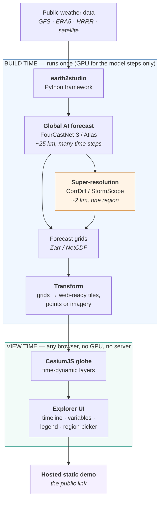

# Latent Sky — Project Concept

> **Status:** Concept / pre-architecture
> **Document:** `DOCS/concept.md`
> **Version:** 0.1
> **Owner:** Kira Ryan
> **Last updated:** 30 July 2026

---

## 1. The three-line summary

**Latent Sky is an interactive 3D globe that shows you the weather as an AI predicts it.**

It pulls real, live atmospheric data from public sources, runs it through NVIDIA's open Earth-2 AI forecasting models, and renders the result as a beautiful, time-scrubbable globe in the browser.

Its signature moment: you fly down to a region and watch a blurry, low-resolution global forecast **snap into razor-sharp kilometre-scale detail** — generated by an AI model, not by a supercomputer.

---

## 2. What this project is

Latent Sky is a **visualisation front-end for AI weather forecasting**.

Traditional numerical weather prediction runs on national supercomputers, takes hours, and produces enormous grids of numbers that almost nobody outside meteorology ever sees. In January 2026 NVIDIA open-sourced the **Earth-2** family of AI weather models, which produce comparable forecasts on a single GPU in seconds rather than hours on a cluster. The models are public. The data feeds are public. What is missing is a way for a human being to *look* at the result and feel something.

That gap is the project.

Latent Sky takes the output of those models and turns it into a living object you can hold and turn — a globe with weather moving across it in time, with legible colour, elegant controls, and a sense of scale. It is deliberately built as much for the eye as for the science. The intent is that a meteorologist finds it accurate and a person who knows nothing about meteorology finds it beautiful, and both of them want to keep scrubbing the timeline.

Three things distinguish it from a generic weather map:

**It is a forecast, not an observation.** Most weather visualisations show what happened or what is happening. Latent Sky shows what an AI model believes *will* happen, out to several days, and lets you move through that predicted future continuously.

**It is 4D, not 3D.** Time is a first-class axis, not a slideshow of images. The globe interpolates smoothly between forecast steps so weather systems flow rather than jump.

**It reveals the AI's actual value.** The hero interaction demonstrates *generative super-resolution* — the coarse ~25 km global forecast being downscaled to ~2 km detail by a diffusion model. This is not upscaling or smoothing. The model has learned what fine-scale atmospheric structure physically looks like and generates plausible detail that was never in the input. Making that difference *visible* is the intellectual core of the project.

---

## 3. Purpose

Latent Sky exists for three reasons, in order of importance.

### 3.1 To make AI weather forecasting legible

The Earth-2 models are a genuine scientific step change, and almost nobody can see it. A well-made public visualisation is a real contribution: it helps people understand what these models do, where they are confident, and what "kilometre-scale AI downscaling" actually means in practice. Weather and climate risk affect everyone; tools that make forecasting comprehensible have value beyond the demo.

### 3.2 To be a portfolio centrepiece

This project is intended to function as a **demonstrable body of work** — a live link rather than a CV bullet. It sits deliberately at the intersection of three competencies that are rarely held by the same person:

- scientific and geospatial data engineering (finding, fetching, transforming heterogeneous atmospheric data)
- AI/ML model integration (running and chaining state-of-the-art forecasting models)
- 3D real-time visualisation and interface design (making the result genuinely beautiful and usable)

It is also aimed squarely at two specific technology ecosystems — **NVIDIA** (Earth-2, Omniverse) and **Cesium** — such that the finished artefact is directly relevant to both.

### 3.3 To be enjoyable to build

This is a weekend project built for the pleasure of building it. That is a real requirement, not a soft one, and it shapes the architecture: every milestone must produce something that visibly works, nothing may depend on a six-week foundation before anything appears on screen, and the scope must survive a weekend being skipped.

---

## 4. Objectives

### 4.1 Primary objectives

1. **Run a real AI forecast.** Execute at least one Earth-2 prognostic model (FourCastNet-3 or Atlas) against live initial conditions and persist the output in a queryable format.
2. **Render forecast data on a 3D globe.** Display at least one atmospheric variable over the Earth in CesiumJS with a considered, perceptually sound colour mapping.
3. **Animate through forecast time.** Provide smooth, scrubbable playback across forecast steps with interpolation, not stepping.
4. **Deliver the super-resolution reveal.** Implement the coarse → fine hero interaction using CorrDiff (or StormScope for nowcasting), with an explicit visual comparison the viewer cannot miss.
5. **Ship it publicly.** A hosted, publicly reachable demo; a clean repository; a short explanatory video; a README that opens with the before/after image.

### 4.2 Secondary objectives

6. An elegant, restrained explorer UI — legend, variable switching, region selection, a short explanatory panel — designed rather than assembled.
7. Multiple atmospheric variables (wind, temperature, precipitation, cloud) with sensible defaults.
8. Reproducibility: any forecast shown can be regenerated from a documented command.
9. Performance: the hosted demo must run acceptably on an ordinary laptop with no discrete GPU.

### 4.3 Explicit non-objectives

These are out of scope and should be actively resisted during architecture:

- **This is not an operational forecasting service.** No uptime guarantee, no live-refresh pipeline, no alerting. Forecasts are precomputed and baked.
- **This is not a meteorological analysis tool.** No sounding diagrams, no model verification statistics, no ensemble spaghetti plots.
- **This is not a global-everything visualiser.** One or two regions, a handful of variables, done exceptionally well.
- **This is not a backend product.** There should ideally be *no server* — static hosting only.
- **This is not a general Earth-2 wrapper library.** earth2studio already exists and is excellent; the project consumes it, it does not reimplement it.

---

## 5. The core concept, in detail

### 5.1 The hero moment

The single interaction the whole project is designed around:

The globe is showing a global forecast — recognisably weather, moving in time, but soft-edged, because the underlying grid is roughly 25 km per cell. The viewer picks a region. The camera flies down. As it arrives, a second layer resolves on top: the same atmosphere, same moment in time, at roughly 2 km per cell, generated by a diffusion model that has learned the fine structure of real weather. Convective cells appear. Terrain-driven precipitation appears. Rain bands acquire edges.

The comparison must be made explicit — a wipe, a split screen, or a toggle — because the entire point is the *difference*. A viewer who does not clearly perceive the before and after has not understood the project.

### 5.2 Why "Latent Sky"

The name refers to the **latent space** of the generative model — the compressed internal representation from which the diffusion model samples fine-scale atmospheric detail. The sky in the hero moment is, literally, drawn out of a latent space. The name is also intended to read as evocative rather than technical to a general audience, which is the correct balance for a project that has to be legible to both a research engineer and a recruiter.

### 5.3 Reserved alternative name: `fovea-earth`

**A second name, `Fovea` / `fovea-earth`, was considered and is deliberately held in reserve.** It is recorded here so that a future rename is an informed decision rather than a re-litigation.

*The case for Fovea:* the fovea is the small central region of the retina that perceives fine detail, surrounded by low-acuity peripheral vision that the brain fills in. This is a precise anatomical analogue of the project's architecture — a coarse global field with one super-resolved window of detail where attention is directed. Critically, **"foveated rendering" is established NVIDIA graphics vocabulary** (VR, variable-rate shading, DLSS), so the name is immediately legible to an NVIDIA graphics engineer as a description of the technique rather than as decoration.

*The case against, at time of choosing:* `Latent Sky` is more evocative, appears substantially unclaimed as a software name, and better communicates the *generative AI* nature of the project to a general audience, whereas `Fovea` emphasises the rendering strategy.

*Collision notes at time of writing:* `Fovea` has several small, largely dormant GitHub repositories using the name (a web-components tool, assorted research code) but no dominant product owns it. `Latent Sky` appears clean.

**If the project's emphasis shifts** from "generative AI forecasting" toward "adaptive multi-resolution rendering", or if it is being targeted specifically at NVIDIA's graphics organisation rather than its climate organisation, `fovea-earth` becomes the stronger name and the rename should be made early rather than late.

---

## 6. Conceptual flow

### 6.1 Reading the flow

The critical architectural property is the **hard split between the two boxes**.

Everything in the GPU box happens **once, offline, ahead of time**. A GPU is rented by the hour, the models are run, the output is written to disk, and the GPU is switched off. This step is a build step, not a runtime step.

Everything in the browser box happens **at view time on the visitor's machine**, using only precomputed files served statically. No server, no API, no inference at runtime, no ongoing cost, no operational burden, and no dependency on a GPU being available when someone clicks the link.

This split is what makes an ambitious project survivable as a weekend build, and it should be treated as a load-bearing architectural constraint rather than a convenience.

---

## 7. Technology

### 7.1 The AI layer

**earth2studio** — NVIDIA's open-source Python framework (`pip install earth2studio`) that provides a single clean API over the model zoo, the data sources, and the output backends. This is the integration point; the project should not touch model weights directly.

**Prognostic models** (predict the future global state): FourCastNet-3 (FCN3), Atlas (Earth-2 Medium Range), plus GraphCast, Pangu, Aurora, FuXi and AIFS available through the same interface.

**Diagnostic / downscaling models** (add detail or derive quantities): **CorrDiff**, a generative diffusion model producing kilometre-scale regional detail from coarse input — this is the hero-moment engine. **StormScope** (Earth-2 Nowcasting) for short-range, high-frequency evolution. **HealDA** for global data assimilation.

**Data sources**, all handled by the framework: GFS (live global, the practical default), ERA5 (reanalysis, best for reproducible historical scenes), HRRR (high-resolution US), IFS, and satellite feeds.

**Output**: Zarr is the natural backend — chunked, dimension-labelled, and directly consumable by xarray for the transform step.

### 7.2 The visualisation layer

**CesiumJS** — the open-source 3D globe. Chosen for accurate WGS-84 geospatial rendering, a genuine time system (`Clock`, `JulianDate`, `SampledProperty`) rather than a bolted-on animation loop, mature 3D Tiles support for large datasets, and terrain that makes the kilometre-scale reveal actually mean something.

**Time handling**: Cesium's clock drives the visualisation. Forecast steps are attached as time-sampled properties so the globe interpolates between them and playback is continuous.

**Rendering strategy is an open architecture question** and should be decided in the architecture document, not here. The realistic candidates are per-timestep imagery layers draped on the globe (simplest, best for scalar fields), point primitives or instanced 3D tiles (best for vector fields like wind, but instance counts must stay bounded), and custom shader materials (most beautiful, most work). The right answer likely differs per variable.

### 7.3 Hosting

Static hosting only — GitHub Pages, Netlify or Vercel. Because all forecast data is precomputed, the deployed artefact is a folder of files. Data volume is the main constraint and will need active management; aggressive subsetting, downsampling for the global view, and full resolution only in the hero region is the expected approach.

---

## 8. What the end user sees and experiences

This section describes the intended experience end to end. It is the acceptance criteria written as a story.

### 8.1 Arrival

The page opens on a dark, quiet Earth, already slowly rotating. Weather is already moving — no empty state, no "click to load", no configuration screen. Within two seconds of arriving the visitor understands that they are looking at a living planet. A single line of text names what they are seeing: the variable, the model, the forecast initialisation time.

### 8.2 The globe

The Earth is rendered in three dimensions and can be freely rotated, tilted and zoomed with the mouse. Over its surface, one atmospheric field is painted in a carefully chosen colour ramp — wind speed, say, flowing in coherent ribbons across the oceans, or cloud fraction wrapping the planet in structured bands. The colours are perceptually uniform and the legend is always visible and always honest about units.

### 8.3 Time

A timeline sits along the bottom. The visitor can press play and watch several days of predicted weather flow across the planet in a smooth continuous motion, or grab the scrubber and move through the forecast by hand, forwards and backwards, at their own pace. The clock reads out the valid time of what is on screen and how far into the future that is. Nothing jumps or flickers between steps.

### 8.4 The reveal

Somewhere visible — a labelled marker on the globe, or a prompt in the interface — the visitor is invited into the hero region. They click. The camera flies down out of orbit toward, for example, Taiwan or the US Great Plains, terrain rising into view as it descends.

As it settles, the resolution changes. What was a soft gradient becomes structure: individual convective cells, precipitation bands with defined edges, orographic detail keyed to the mountains beneath. A control lets the visitor wipe or toggle between the two, and a short caption states plainly what just happened — that a generative AI model produced roughly 2 km detail from roughly 25 km input, in seconds, on a single GPU.

**This is the moment the project exists to deliver.** Everything else is in service of it.

### 8.5 Exploration

Having understood the idea, the visitor can play. They can switch variables, move the timeline, orbit the region, return to the global view, and read a short panel explaining the models and where the data came from. The interface stays out of the way; controls are few, legible, and quiet.

### 8.6 Leaving

The visitor leaves with three things: a clear visual memory of the reveal, an accurate understanding of what AI weather models do, and — the point of §3.2 — an impression of the person who built it. A link to the repository and to a short video is unobtrusively available for anyone who wants to go further.

### 8.7 Experience principles

- **No blank states.** Something beautiful is always on screen; loading happens behind motion.
- **The data is never misrepresented.** Colour ramps are perceptually uniform, units are stated, and generated detail is labelled as generated. A visualisation that lies to look good is a failure regardless of how it looks.
- **Restraint over density.** Fewer, better-chosen controls. Every element must earn its place on screen.
- **It should feel like an instrument, not a dashboard.** Precise, crafted, calm.

---

## 9. Delivery milestones

Sequenced so that every milestone ends in a working, showable artefact. The project is presentable from M2 onward.

| ID | Milestone | Outcome | Type |
|----|-----------|---------|------|
| **M0** | Two hello-worlds | `earth2studio` produces a forecast file on a rented GPU; a bare CesiumJS globe renders locally with an ion token. The two halves exist. | Core |
| **M1** | Data on the globe | One variable, one timestep, transformed from the forecast grid and painted onto the globe with a real colour ramp. First genuine visual. | Core |
| **M2** | Make it move | All forecast steps loaded, Cesium clock driving smooth interpolated playback, basic variable toggle. Now demo-worthy. | Core |
| **M3** | The reveal | CorrDiff run over the chosen region; hero fly-to implemented; explicit coarse/fine comparison. The money shot. | Wow |
| **M4** | Make it art | The explorer UI designed properly — legend, panels, typography, colour, motion, interaction polish. | Wow |
| **M5** | Ship | Static hosting, 60–90 second capture, README with the before/after at the top, public repository, launch post. | Ship |

**Stretch, strictly optional:** nowcast a real named storm event; a second hero region; an ensemble or uncertainty layer; a Cesium-for-Omniverse variant.

---

## 10. Constraints and assumptions

**GPU access is rented and time-boxed.** No local RTX hardware is assumed. Compute is a metered resource spun up for a run and shut down immediately after, so any workflow that requires a long-lived GPU is disqualified.

**The end user has no GPU.** The hosted demo must perform on an ordinary laptop's integrated graphics. This bounds instance counts, texture sizes and total payload.

**Data volume is the primary technical risk.** Full-resolution global forecast grids across many timesteps are far too large to serve statically. Subsetting, downsampling and format choice are architecture-critical, not implementation details.

**Development time is weekends only.** Any task that cannot be completed or safely parked within a weekend must be broken down further.

**All data and models used must be publicly licensed** and the licence terms of the Earth-2 models, earth2studio, CesiumJS and any Cesium ion assets must be checked and honoured before public release.

**A Cesium ion token is required** for terrain and base imagery; the free tier is expected to be sufficient, but token handling must not leak credentials into a public repository.

---

## 11. Definition of done

The project is complete when a person who has never spoken to the author can open a public link on an ordinary laptop, understand within thirty seconds what they are looking at, watch several days of AI-predicted weather move across a three-dimensional Earth, trigger the super-resolution reveal and clearly perceive the difference, and come away able to explain to someone else what NVIDIA's Earth-2 models do — and that the whole thing is beautiful enough that they send the link to someone.

---

## 12. Open questions for the architecture document

Deliberately unresolved here. These are the decisions the architecture phase must make:

1. **Rendering strategy per variable.** Imagery layers vs. point primitives vs. instanced 3D tiles vs. custom shader materials — and whether a single strategy can serve all variables or whether scalar and vector fields need different pipelines.
2. **Data format and payload budget.** What is the total acceptable download size, and what combination of subsetting, downsampling, quantisation and tiling gets under it without visible degradation?
3. **The transform pipeline.** Zarr → browser-ready. Which tool chain (xarray, rio-xarray, GDAL, py3dtiles, custom), and is it a reproducible script or a manual step?
4. **Time representation.** `SampledProperty` interpolation vs. pre-rendered per-step imagery vs. shader-side blending between two textures.
5. **Hero region selection.** Which region, and is it fixed at build time or selectable from a small set of precomputed options?
6. **The coarse/fine comparison mechanism.** Wipe, split screen, toggle, or animated transition — decided by what most clearly communicates the difference.
7. **Repository structure.** Monorepo with `pipeline/` (Python) and `web/` (JS), or separate repositories?
8. **Build reproducibility.** Are the generated data artefacts committed, released as assets, or regenerated on demand?
9. **Colour science.** Which perceptually uniform ramps per variable, and how are they kept consistent between the coarse and fine layers so the reveal reads as detail appearing rather than colour shifting?

---

## 13. Glossary

**Downscaling** — producing higher-resolution output from lower-resolution input. In this project it is *generative*: the model synthesises physically plausible detail rather than interpolating.

**Prognostic model** — a model that advances the atmospheric state forward in time to produce a forecast.

**Diagnostic model** — a model that derives additional quantities or detail from a given state without advancing time.

**Initial conditions** — the observed or analysed state of the atmosphere at the moment a forecast starts.

**Nowcasting** — very short-range forecasting, typically zero to six hours, at high temporal frequency.

**Reanalysis (ERA5)** — a consistent historical reconstruction of past atmospheric states; ideal for reproducible demonstrations because it never changes.

**Zarr** — a chunked, compressed, cloud-friendly array storage format used for multidimensional scientific data.

**Latent space** — the compressed internal representation a generative model samples from. The project's namesake.

---

*This document defines what Latent Sky is and why it exists. It does not define how it is built — that is the architecture document's job.*
